# Functional Requirements

Functional requirements define **what** a system must enable users, administrators, and connected systems to do. They describe observable capabilities and business outcomes. Each requirement should have clear acceptance criteria, business rules, and error behaviour.

> Functional requirement: *An administrator can configure a policy and publish it for use.*
>
> Quality attribute: *The policy configuration service must be observable and recoverable by an authorised engineer who did not build it.*

## Functional-requirements hierarchy

```mermaid
flowchart TD
    A["Functional Requirements"]

    A --> B["User capabilities"]
    B --> B1["Account access"]
    B1 --> B1a["Register or sign in"]
    B1 --> B1b["Manage profile and preferences"]
    B --> B2["Information access"]
    B2 --> B2a["View records and status"]
    B2 --> B2b["Search, filter and sort"]
    B --> B3["Record management"]
    B3 --> B3a["Create or update records"]
    B3 --> B3b["Submit or cancel requests"]

    A --> C["Business workflows"]
    C --> C1["Input handling"]
    C1 --> C1a["Validate data"]
    C1 --> C1b["Show actionable errors"]
    C --> C2["Decisioning"]
    C2 --> C2a["Apply business rules"]
    C2 --> C2b["Calculate outcomes"]
    C --> C3["Process control"]
    C3 --> C3a["Route approvals"]
    C3 --> C3b["Track workflow state"]
    C --> C4["Exception handling"]
    C4 --> C4a["Escalate exceptions"]
    C4 --> C4b["Record decisions"]

    A --> D["Communication & outputs"]
    D --> D1["Notifications"]
    D1 --> D1a["Send event notifications"]
    D1 --> D1b["Manage notification preferences"]
    D --> D2["Reporting"]
    D2 --> D2a["Generate operational reports"]
    D2 --> D2b["Provide status summaries"]
    D --> D3["Data exchange"]
    D3 --> D3a["Export authorised data"]
    D3 --> D3b["Generate documents"]

    A --> E["Integration capabilities"]
    E --> E1["Inbound integration"]
    E1 --> E1a["Receive API requests"]
    E1 --> E1b["Consume events or files"]
    E --> E2["Outbound integration"]
    E2 --> E2a["Publish events"]
    E2 --> E2b["Call external services"]
    E --> E3["Data synchronisation"]
    E3 --> E3a["Map and validate data"]
    E3 --> E3b["Reconcile state"]
    E --> E4["Integration exceptions"]
    E4 --> E4a["Handle failures"]
    E4 --> E4b["Retry or route for review"]

    A --> F["Administration"]
    F --> F1["User management"]
    F1 --> F1a["Manage users"]
    F1 --> F1b["Manage roles"]
    F --> F2["System configuration"]
    F2 --> F2a["Configure business rules"]
    F2 --> F2b["Manage feature controls"]
    F --> F3["Governance administration"]
    F3 --> F3a["Review audit history"]
    F3 --> F3b["Manage retention actions"]
```

## Requirement-writing test

A good functional requirement is observable and testable:

- **Actor:** who performs the action?
- **Capability:** what can they do?
- **Object:** to what record, process, or information?
- **Rule:** what constraints or decisions apply?
- **Outcome:** what successful result, status, or output is expected?
- **Exception:** what happens when the action cannot complete?

Example:

> A policy administrator can update a versioned eligibility rule, validate it against required controls, and publish it only after approval. If validation fails, the system shows the failed controls and preserves the previously published version.

## Relationship to quality attributes

Functional requirements define the system's behaviour. Quality attributes define the required standard of that behaviour. Both are input to the HLD, architecture decisions, delivery plan, and acceptance criteria.
