# Quality Attributes (Non-Functional Requirements)

Quality attributes, often called non-functional requirements (NFRs), define **how well** a system must work and the constraints it must meet. They are architecture drivers: trade-offs in the design should be traceable to a quality attribute and an observable measure.

> Functional requirement: *The administrator can deploy a policy.*
>
> Quality attribute: *An authorised engineer who did not build the service can deploy, observe, roll back, and recover it using documented steps.*

## Quality-attribute hierarchy

```mermaid
flowchart TD
    A["Quality Attributes / NFRs"]

    A --> B["Operability"]
    B --> B1["Deployability"]
    B1 --> B1a["Repeatable pipeline"]
    B1 --> B1b["Safe rollback"]
    B --> B2["Observability"]
    B2 --> B2a["Logs, metrics and traces"]
    B2 --> B2b["Alerts and dashboards"]
    B --> B3["Recoverability"]
    B3 --> B3a["Backup and restore"]
    B3 --> B3b["Incident recovery"]
    B --> B4["Supportability"]
    B4 --> B4a["Runbooks and ownership"]
    B4 --> B4b["Access for support"]
    B --> B5["Configurability"]
    B5 --> B5a["Externalised configuration"]
    B5 --> B5b["Safe feature controls"]

    A --> C["Reliability & Resilience"]
    C --> C1["Availability"]
    C1 --> C1a["Uptime objective"]
    C1 --> C1b["Graceful degradation"]
    C --> C2["Fault tolerance"]
    C2 --> C2a["Retries and timeouts"]
    C2 --> C2b["Isolation and failover"]
    C --> C3["Data integrity"]
    C3 --> C3a["Validation and consistency"]
    C3 --> C3b["Idempotency and reconciliation"]
    C --> C4["Disaster recovery"]
    C4 --> C4a["Recovery time objective"]
    C4 --> C4b["Recovery point objective"]

    A --> D["Maintainability & Change"]
    D --> D1["Modifiability"]
    D1 --> D1a["Clear boundaries"]
    D1 --> D1b["Low-risk change paths"]
    D --> D2["Testability"]
    D2 --> D2a["Automated verification"]
    D2 --> D2b["Deterministic test environments"]
    D --> D3["Reusability"]
    D3 --> D3a["Stable interfaces"]
    D3 --> D3b["Proven shared components"]
    D --> D4["Understandability"]
    D4 --> D4a["Architecture decisions"]
    D4 --> D4b["Current documentation"]

    A --> E["Security & Governance"]
    E --> E1["Identity and access"]
    E1 --> E1a["Authentication"]
    E1 --> E1b["Authorisation"]
    E --> E2["Privacy and data protection"]
    E2 --> E2a["Data minimisation"]
    E2 --> E2b["Retention and deletion"]
    E --> E3["Auditability"]
    E3 --> E3a["Traceable actions"]
    E3 --> E3b["Tamper-aware records"]
    E --> E4["Compliance"]
    E4 --> E4a["Policy controls"]
    E4 --> E4b["Evidence and reporting"]

    A --> F["Efficiency & Experience"]
    F --> F1["Performance"]
    F1 --> F1a["Latency"]
    F1 --> F1b["Throughput"]
    F --> F2["Scalability"]
    F2 --> F2a["Capacity growth"]
    F2 --> F2b["Load distribution"]
    F --> F3["Usability & accessibility"]
    F3 --> F3a["Task clarity"]
    F3 --> F3b["Inclusive access"]
    F --> F4["Portability & compatibility"]
    F4 --> F4a["Environment portability"]
    F4 --> F4b["Integration compatibility"]
```

## Operability: the independent-operator test

A system is operationally ready when an authorised engineer who did not build it can:

1. Build and deploy the same artefact through the standard pipeline.
2. Locate logs, metrics, traces, dashboards, alerts, and ownership information.
3. Diagnose a documented failure.
4. Roll back, restore, or recover safely using a runbook.
5. Change approved configuration without hidden knowledge or manual laptop-only steps.

The controls normally include infrastructure as code, externalised configuration, CI/CD, documented ownership, least-privilege access, observability, tested backups, incident runbooks, and a genuine handover exercise.

## Reuse rule

Do not abstract for imagined reuse. Create a clean boundary for one real use case. Extract a shared component when a second proven use case has the same stable need.
