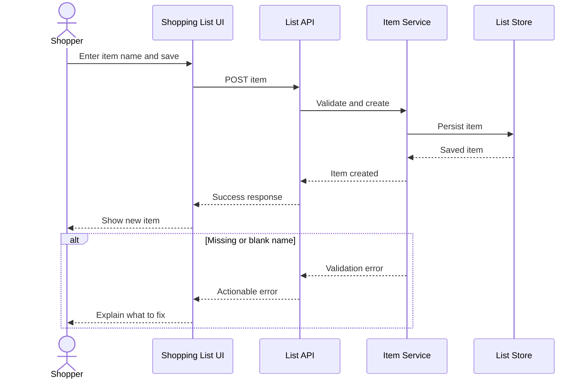

# Create a shopping-list item

**Parent:** [User Capabilities](user-capabilities_readme.md)  
**Level:** L4  
**Status:** Learning example, not a product commitment

## Why this is a good example

It is a small, recognisable outcome with one actor, one rule, a success path, and an error path. That makes it easy to trace from requirement to interaction and then to an acceptance test.

## Functional requirement

A signed-in shopper can add a named item to a shopping list. The system rejects a missing or blank name and does not create an item.

## Acceptance scenario

- **Given** a signed-in shopper viewing a shopping list
- **When** they enter a non-blank item name and save it
- **Then** the new item appears in that list
- **And** the system confirms that it was saved

- **Given** a signed-in shopper viewing a shopping list
- **When** they try to save a blank item name
- **Then** the system shows an actionable validation message
- **And** it does not create an item

## Interaction

## Evidence

An automated acceptance test should cover the successful save and the blank-name rejection. A C4 container or component view, when introduced in the Architecture branch, should be referenced from this requirement instead of reproduced here.

## Quality boundary

This document says **what** happens. It does not set a latency target, prescribe a deployment tool, or claim that the system can be operated by someone else. Those are quality attributes. The paired example is [Independent-operator readiness](../../quality-attributes/operability/independent-operator-readiness.md).
