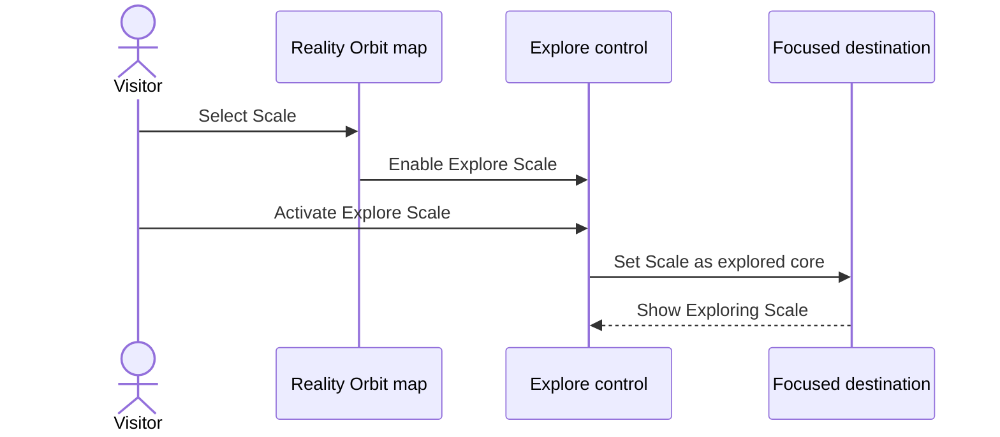

# Explore the selected ontology node

**Parent:** [User Capabilities](user-capabilities_readme.md)  
**Level:** L4  
**Status:** Reality Orbit product example

## Why this is a good example

It is a single, observable user outcome with one actor, one primary action, a success path, and a clear non-goal. It stays inside Reality Orbit’s public map instead of inventing a shopping-list product.

## Functional requirement

A visitor who has selected a canonical ontology node can start exploration of that node from the contextual Explore control. The control names the selected node and uses the node’s dimension colour.

## Acceptance scenario

- **Given** a visitor viewing the Reality Orbit map with Scale selected
- **When** they activate Explore Scale
- **Then** the map focuses Scale as the explored destination
- **And** the control shows Exploring Scale while that focus remains

- **Given** a visitor with no explorable selected destination
- **When** they look for Explore
- **Then** the control stays unavailable or inactive
- **And** the system does not invent a destination

## Interaction

## Non-goals

- Does not add, rename, or reorder ontology nodes.
- Does not require authentication or paid features.
- Does not replace Concept Anatomy teaching content.

## Traceability

- Product surface: Reality Orbit map Explore control
- Related backlog: Release contextual Explore {node} theme
