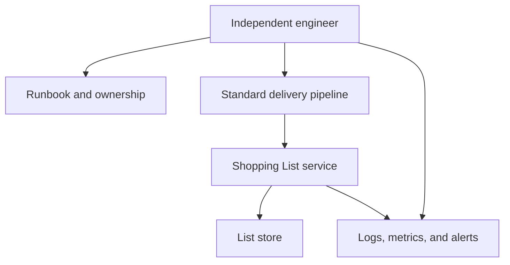

# Independent-operator readiness

**Parent:** [Operability](operability_readme.md)  
**Level:** L4  
**Status:** Learning example, not a production service-level target

## Quality attribute statement

An authorised engineer who did not build the Shopping List service can use documented standard steps to deploy it, find its operational signals, diagnose a known failure, and restore service without relying on the original author's laptop or private knowledge.

## Quality-attribute scenario

| Element | Example |
| --- | --- |
| Source | An engineer new to the service |
| Stimulus | They deploy a change or investigate a known service or data-store failure |
| Environment | A supported development, test, or non-production environment |
| Artifact | Shopping List service, delivery path, list store, and operational documentation |
| Response | The engineer follows the standard pipeline and runbook, uses health and telemetry signals, and completes the recovery path |
| Response measure | In a handover exercise, the engineer completes the path without author assistance and records any gaps. A team may later set a time objective. |

## Operating context

## Handover evidence

The example is accepted when a different engineer can:

1. Use the standard path to build or deploy the service.
2. Locate the owner, runbook, health signal, logs, and relevant dashboard or alert.
3. Diagnose a prepared failure scenario.
4. Follow the documented recovery or rollback procedure.
5. Record the result and improve the documentation if a step was missing.

## What this prevents

“Works on my machine” is not operability evidence. A system is not independently operable when release, configuration, diagnosis, or recovery require unrecorded knowledge, a private laptop setup, or the original builder.

## Boundaries

This leaf does not set performance, availability, authentication, or data-retention targets. Those are separate quality-attribute scenarios when the product needs them.
