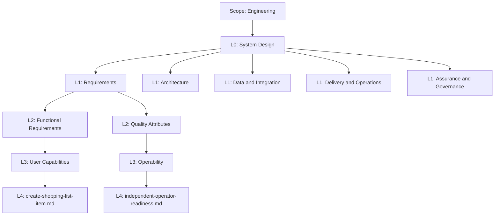

# System Design

**Scope:** Engineering  
**Level:** L0  
**Status:** Decision

## Purpose

System Design is the shared map from engineering intent to a system that can be built, run, and changed. It keeps requirements, architecture, operational concerns, and evidence connected without treating them as the same thing.

## Level model

- **Scope** is a repository and organisational route, not a numbered level.
- **L0** is the complete System Design domain.
- **L1** separates the major design concerns. A System Design tree has at most five L1 branches.
- **L2** and **L3** progressively organise a concern.
- **L4** is a single, teachable Markdown artefact.

This PR materialises the **Requirements** branch only. The other L1 branches are named here so the eventual structure has a stable home, but their folders are intentionally out of scope.

## Folder convention

Every non-terminal folder contains a file named `<folder>_readme.md`. It records the folder's purpose, scope, child artefacts, and common confusions. The README describes the folder; it does not create another semantic level.

## Current map

| Path | Role |
| --- | --- |
| `requirements/` | L1 branch for statements of needed behaviour and measurable qualities |
| `requirements/functional-requirements/` | L2: what the system must do |
| `requirements/quality-attributes/` | L2: how well it must work, including constraints |
| `requirements/functional-requirements/user-capabilities/create-shopping-list-item.md` | L4 functional learning example |
| `requirements/quality-attributes/operability/independent-operator-readiness.md` | L4 operability learning example |

## Boundaries

This is a stable engineering learning reference, not a product backlog or an implementation plan. A product-specific requirement should link to its product decision and acceptance evidence when it is added.
